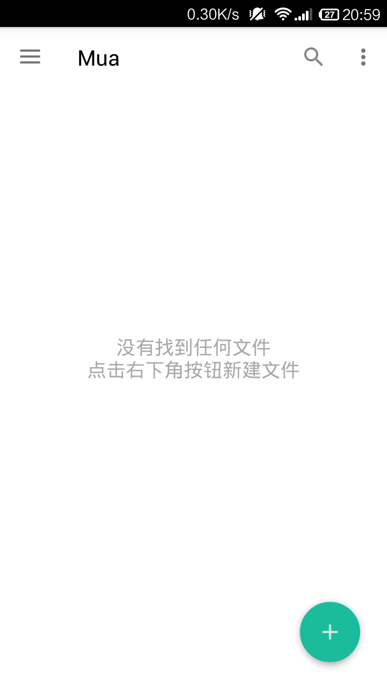
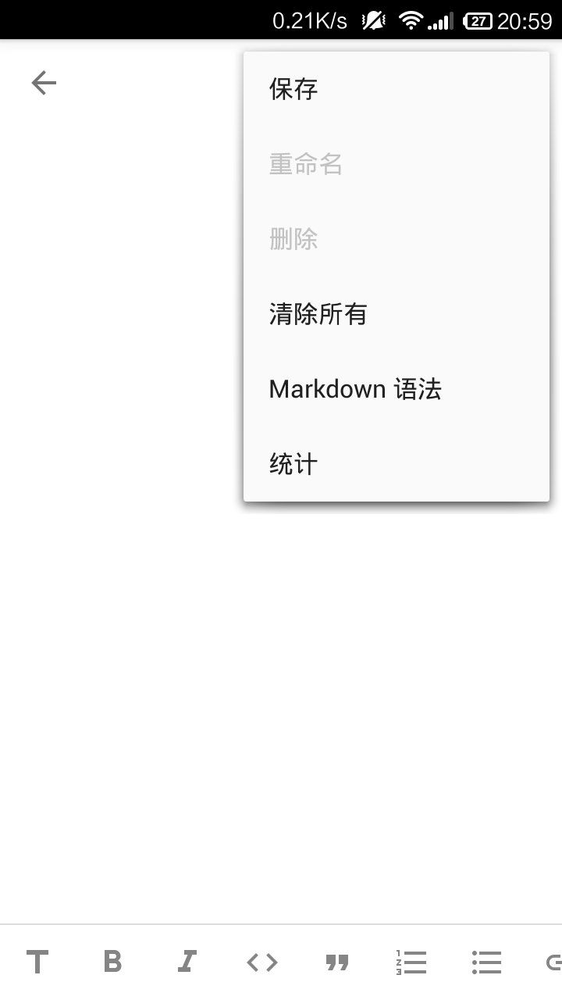
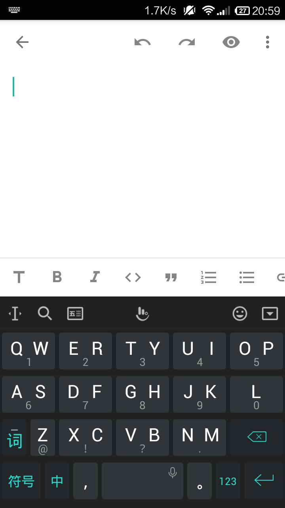
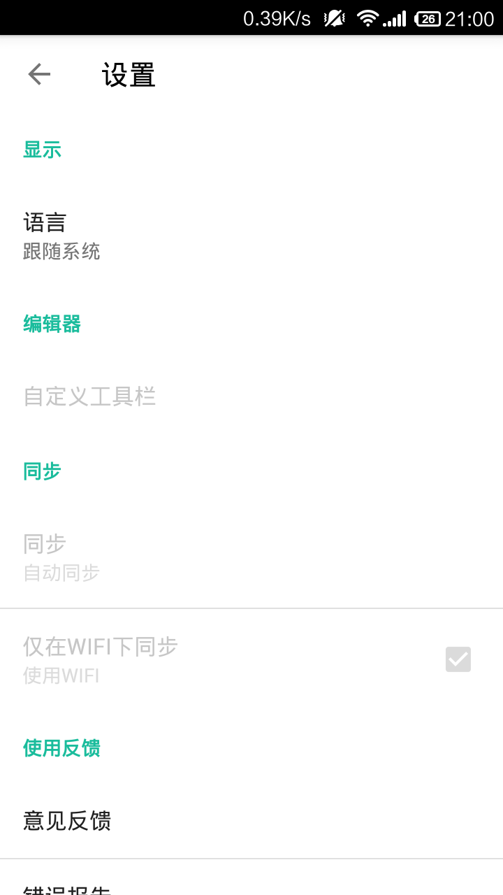
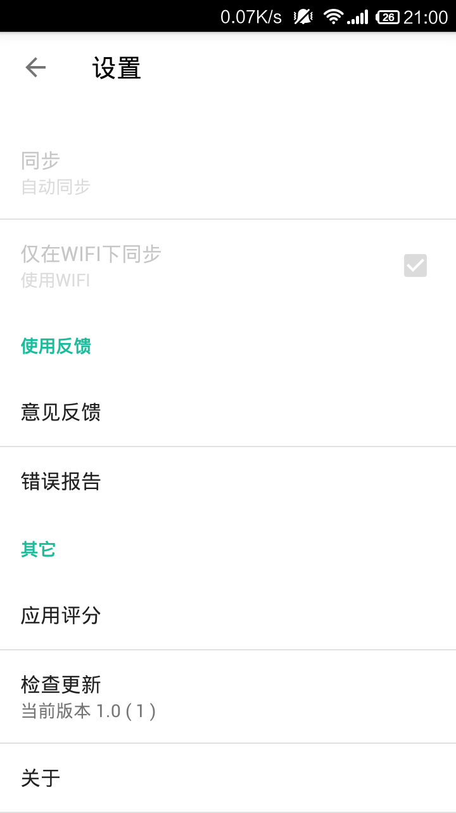
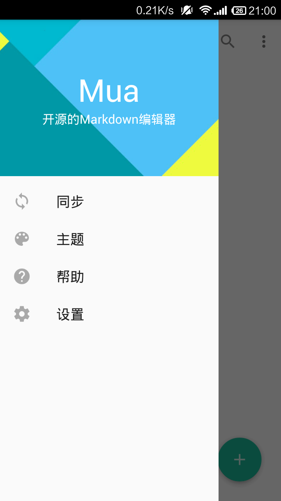
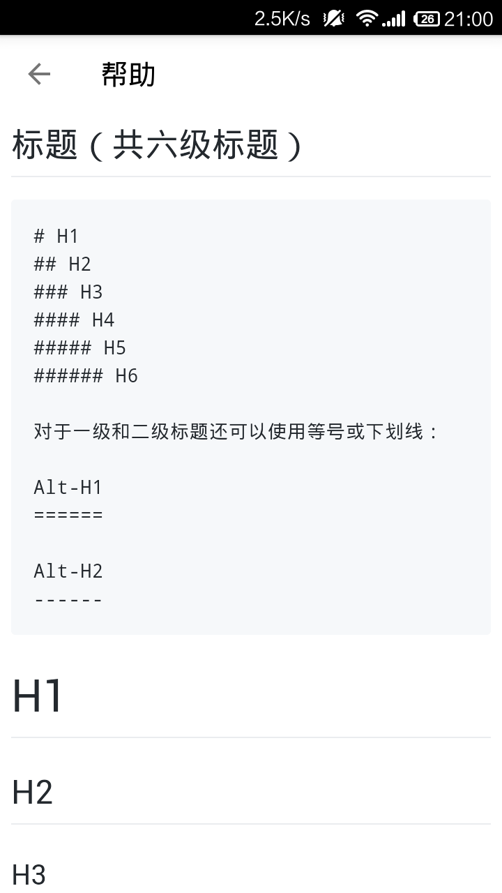
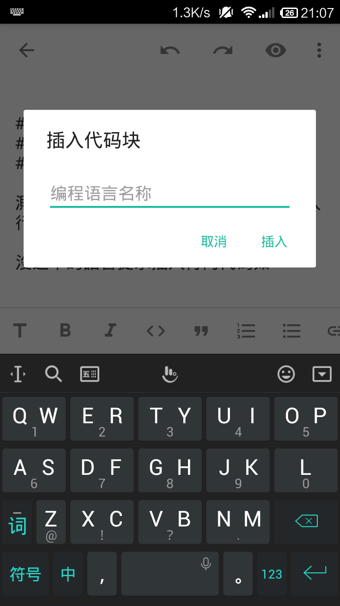
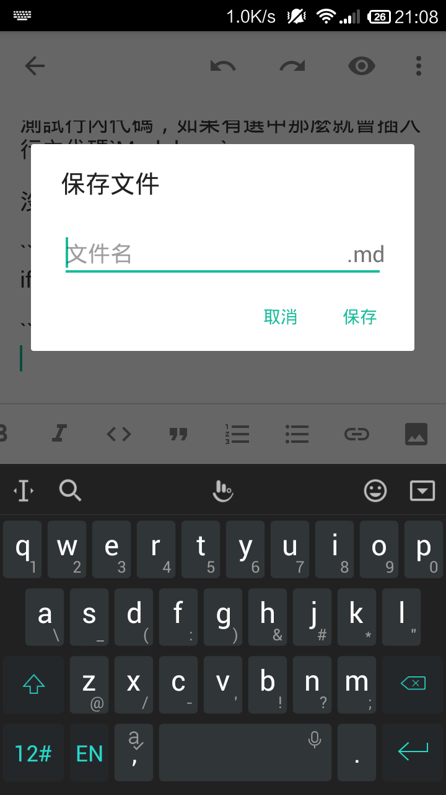
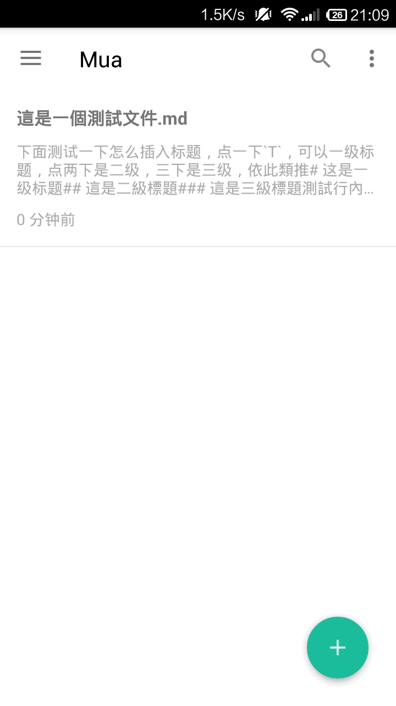

# Mua
An open source markdown editor for Android.

## Features
* Multi-language support
* GFM support
* Markdown cheat sheet support
* Editor toolbar, that you can insert the markdown code, image, bold, italic and more.
* Menu operation, that allows you save, rename, delete and more.
* Search for files
* Under MIT license

## Dependencies
### Java
* [Butter Knife](https://github.com/JakeWharton/butterknife)
* [EventBus](https://github.com/greenrobot/EventBus)
* [BottomSheet](https://github.com/Flipboard/bottomsheet)
* [Android Support library - preference v7 bugfix](https://github.com/Gericop/Android-Support-Preference-V7-Fix)

### JavaScript
* [marked](https://github.com/chjj/marked)

## Screenshots

  
  
  

  
  
  

  
  
  

  

## License
Under MIT license, check the [license file](https://github.com/zeleven/mua/blob/master/LICENSE) for more detail.
